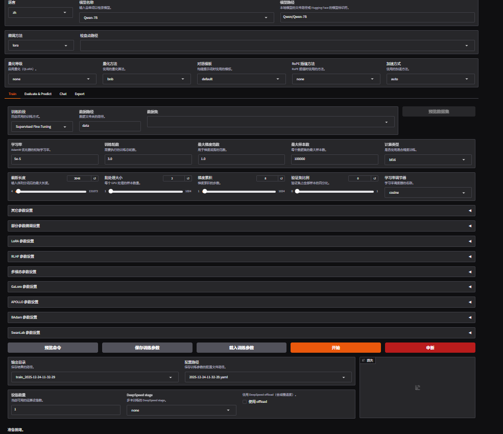
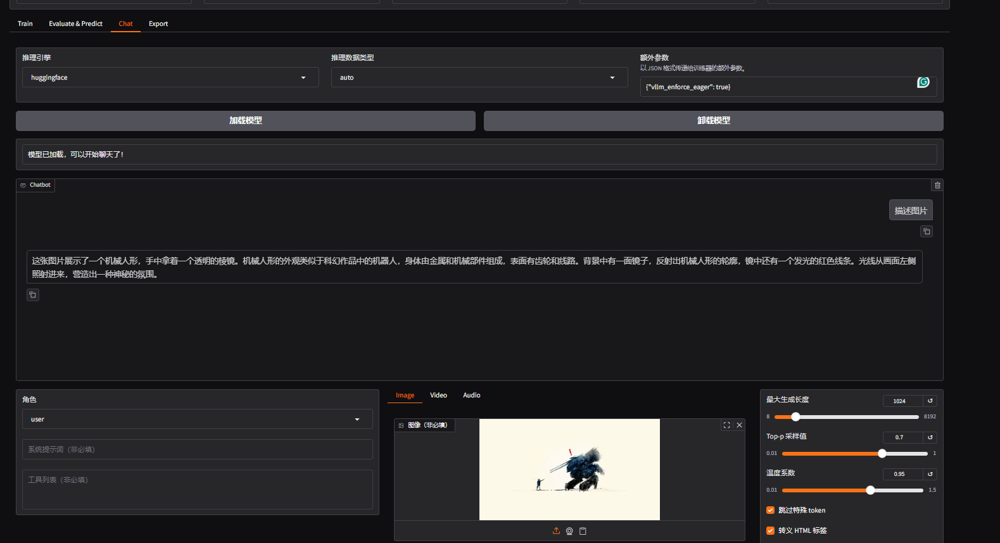

# 模块 01：单卡推理冒烟（文本 + 多模态）

目标：在一张空闲 4090 上完成最小可行推理，验证模型权重、模板、tokenizer 与多模态链路，形成可靠基线。

## 前提与资源约束
- GPU：优先选择一张当前空闲的 GPU（运行前先看 `nvidia-smi`）。本机最近空闲示例：使用 GPU 6（`CUDA_VISIBLE_DEVICES=6`）。
- CPU：使用约一半核心，避免占满整机。
- 环境：Conda `videofen`，PyTorch 2.3.1 + CUDA 12.1；已可导入 torch/deepspeed/transformers/ktransformers。
- 目录约定：工作区根 `/home/zzy/weitiao`；日志建议放 `logs/`，模型缓存放 `/home/zzy/models/`。

## 一次跑通的详细步骤（可直接照抄执行）
说明：模型与缓存路径统一放在工作区内，避免写到仓库根之外。

### Step 0：准备目录与镜像配置（大陆网络，仓库根执行一次即可）
```bash
cd /home/zzy/weitiao
mkdir -p logs models .cache/huggingface

# 启用清华 PyPI 镜像，加速 Python 包安装
pip config set global.index-url https://pypi.tuna.tsinghua.edu.cn/simple

# Hugging Face 镜像与缓存目录（会话内有效，建议写入 ~/.bashrc 持久化）
export HF_ENDPOINT=https://hf-mirror.com
export HF_HOME=/home/zzy/weitiao/.cache/huggingface
export HUGGINGFACE_HUB_CACHE=/home/zzy/weitiao/.cache/huggingface/hub
```
说明：目录与缓存均在 /home/zzy/weitiao 内部，便于备份和权限管理。

### Step 1：激活环境并安装 LLaMA-Factory CLI（当前测试用 0.9.3，需禁用 flash-attn）
```bash
conda activate videofen
pip install -U pip
# 移除可能不兼容的 flash-attn，加速导入排障
pip uninstall -y flash-attn flash_attn flash-attn-xformers || true

# 镜像源可用的版本最高 0.9.3
pip install -U --extra-index-url https://pypi.tuna.tsinghua.edu.cn/simple \
  llamafactory==0.9.3 \
  transformers==4.52.4 \
  accelerate==1.7.0 \
  datasets==3.6.0 \
  gradio==5.31.0 \
  gradio_client==1.10.1 \
  tokenizers==0.21.1

# 导入检查（关闭 flash-attn 分支）
export TRANSFORMERS_NO_FLASH_ATTENTION=1
python - <<'PY'
import llamafactory
from llamafactory.cli import main
print('llamafactory ok')
PY

# CLI 是否可用（可选检查）
llamafactory-cli --help | head -n 5
```
验证依赖：
```bash
python - <<'PY'
import torch, transformers, deepspeed, ktransformers
print('torch', torch.__version__)
print('transformers', transformers.__version__)
print('deepspeed', deepspeed.__version__)
PY
```

### Step 2：预下载模型（保持 huggingface_hub 0.36.x，重复命令可续传）
> 由于镜像源限制，建议保持 transformers 兼容的 huggingface_hub==0.36.x。`hf download` 无续传参数，但多次重试会复用已下分块；huggingface-cli 同样可多次重试。

1) 确认/恢复 huggingface_hub 版本（如已升级过）：
```bash
pip install -U "huggingface_hub==0.36.0"
```

2) 使用 hf download（推荐，失败就反复同一命令）：
```bash
# 文本模型（若已完成可跳过）
hf download Qwen/Qwen2.5-7B-Instruct \
  --local-dir /home/zzy/weitiao/models/Qwen2.5-7B-Instruct \
  --max-workers 4

# 多模态模型（失败重试即可续传）
hf download Qwen/Qwen2-VL-7B-Instruct \
  --local-dir /home/zzy/weitiao/models/Qwen2-VL-7B-Instruct \
  --max-workers 4
```

  下载后，确认本地目录包含完整 tokenizer 相关文件（如 tokenizer.json、tokenizer_config.json、vocab.json 或 merges.txt、qwen.tiktoken、config.json、model-0000x-of-0000y.safetensors 等）。若缺少 tokenizer 文件：
  - 先临时关闭离线模式：`unset HF_HUB_OFFLINE; unset TRANSFORMERS_OFFLINE`；
  - 再执行一次对应的 `hf download ... --local-dir ... --max-workers 4` 补齐文件；
  - 补齐后恢复离线：`export HF_HUB_OFFLINE=1; export TRANSFORMERS_OFFLINE=1`。

3) 兜底方案（huggingface-cli，多次重试可续传）：
```bash
huggingface-cli download Qwen/Qwen2-VL-7B-Instruct \
  --local-dir /home/zzy/weitiao/models/Qwen2-VL-7B-Instruct \
  --local-dir-use-symlinks False
```

常见下载故障排查：
- 暂时关闭镜像：`unset HF_ENDPOINT` 后重试，或 `HF_ENDPOINT=https://huggingface.co`。
- 配置代理（如有）：`export HTTPS_PROXY=http://127.0.0.1:7890`；无代理则不要设置。
- 降低并发：`--max-workers 1` 或 2，减小连接压力。
- 多次重试同一命令，已下载分块会自动复用（即便无 `--resume-download` 参数）。

### Step 3：文本模型单卡推理冒烟（Qwen2.5-7B-Instruct）
```bash
CUDA_VISIBLE_DEVICES=6 TRANSFORMERS_NO_FLASH_ATTENTION=1 \
llamafactory-cli chat \
  --model_name_or_path /home/zzy/weitiao/models/Qwen2.5-7B-Instruct \
  --template qwen
```
交互出现 `>> User:` 后，输入一句话（中/英文）并确认模型能正常回复。

### Step 4：多模态单卡推理冒烟（Qwen2-VL-7B-Instruct）
准备一张本地图片路径（例：/home/zzy/weitiao/sample.jpg），命令如下：
```bash
CUDA_VISIBLE_DEVICES=6 TRANSFORMERS_NO_FLASH_ATTENTION=1 \
llamafactory-cli chat \
  --model_name_or_path /home/zzy/weitiao/models/Qwen2-VL-7B-Instruct \
  --template qwen2_vl
```
根据 CLI 提示上传/指定图片路径，模型能描述图片或回答图片相关问题即为通过。

如果想用图形界面（可选，强制离线避免误拉取 Hub 权重），最少只需要这一行（前提：Step 0 已导出 HF_HOME/HUGGINGFACE_HUB_CACHE；若新开 shell 先 `source ~/.bashrc` 或手动再导出一次）：
```bash
CUDA_VISIBLE_DEVICES=6 HF_HUB_OFFLINE=1 TRANSFORMERS_OFFLINE=1 TRANSFORMERS_NO_FLASH_ATTENTION=1 \
llamafactory-cli webui \
  --model_name_or_path /home/zzy/weitiao/models/Qwen2.5-7B-Instruct \
  --cache_dir /home/zzy/weitiao/.cache/huggingface \
  --template qwen \
  --server_name 0.0.0.0 --port 7860
```
注意：务必确保 model_name_or_path 指向本地已下载的目录 `/home/zzy/weitiao/models/Qwen2.5-7B-Instruct`，否则 UI 可能回退到在线模型（如 Qwen/Qwen-7B）并报缺少分片。
若仍意外加载 Qwen/Qwen-7B，可先清理残留缓存后重启 UI：
```bash
rm -rf /home/zzy/weitiao/.cache/huggingface/hub/models--Qwen--Qwen-7B
```
在 Web UI 界面内的设置建议：
- 模型路径输入框手动填 `/home/zzy/weitiao/models/Qwen2.5-7B-Instruct`，不要从下拉选择远程模型。
- 推理引擎选 huggingface；微调方法选 none；量化选 none；RoPE/加速均保持 auto/none。
- 若仍报 tokenizer 加载失败，先暂时取消离线：`unset HF_HUB_OFFLINE; unset TRANSFORMERS_OFFLINE`，重试一次加载补齐小文件后，再恢复离线变量。


### Step 5：记录结果（建议写入 logs/）
在 logs/ 中追加记录，示例：
```
[2025-12-24] single-gpu smoke
cmd: CUDA_VISIBLE_DEVICES=6 llamafactory-cli chat --model_name_or_path /home/zzy/models/Qwen2.5-7B-Instruct --template qwen
vram_peak: ~14GB (nvidia-smi)
latency: ~X s/turn
status: pass
notes: 正常吐字
```
多模态同理记录显存（预期 ~18GB）与响应质量。

### Step 6（可选）：LLaMA-Factory Web UI 体验
若习惯图形界面，可按下述方式启动 Web UI（默认 Gradio）：

1) 确认依赖已安装；若缺少 Web 相关依赖，可补装：
```bash
pip install -U gradio fastapi uvicorn
```

2) 启动 Web UI（绑定一张空闲 GPU；示例为 GPU 6）：
```bash
CUDA_VISIBLE_DEVICES=6 TRANSFORMERS_NO_FLASH_ATTENTION=1 \
llamafactory-cli webui \
  --model_name_or_path /home/zzy/weitiao/models/Qwen2.5-7B-Instruct \
  --template qwen \
  --server_name 0.0.0.0 \
  --port 7860
```
多模态可将 model_name_or_path 改为 `/home/zzy/models/Qwen2-VL-7B-Instruct`，模板为 `qwen2_vl`。

3) 浏览器访问：
- 本机： http://127.0.0.1:7860
- 远程（需端口转发或安全访问）： http://<服务器IP>:7860

4) 停止：在运行 UI 的终端 Ctrl+C。

## 步骤 A：文本模型推理冒烟（Qwen2.5-7B-Instruct）
```bash
CUDA_VISIBLE_DEVICES=6 llamafactory-cli chat \
  --model_name_or_path Qwen/Qwen2.5-7B-Instruct \
  --template qwen
```
通过标准：出现交互提示 `>> User:`，输入一句中文/英文对话能正常回复。

## 步骤 B：多模态推理冒烟（Qwen2-VL-7B-Instruct）
```bash
CUDA_VISIBLE_DEVICES=6 llamafactory-cli chat \
  --model_name_or_path Qwen/Qwen2-VL-7B-Instruct \
  --template qwen2_vl
```
操作要点：
- 准备一张本地图像路径，按 CLI 提示上传/指定。
- 模型能返回连贯的图像描述或回答与图片相关的问题即为通过。

## 观察与记录模板
建议在每次运行后记录：
- 日期 / commit / 环境（驱动、库版本）
- 命令行与关键参数（batch/seq len 若有）
- 显存峰值：`nvidia-smi` 截图或手动记录（预期文本约 14 GB，VL 约 18 GB）
- 吞吐/延迟：若 CLI 无显式吞吐，可记录单轮响应时延
- 问题与解决：例如 OOM → 减小 batch/序列长度；下载慢 → 配置镜像

可参考记录格式（追加到 logs/ 日志文件）：
```
[2025-12-24] single-gpu smoke
cmd: CUDA_VISIBLE_DEVICES=6 llamafactory-cli chat --model_name_or_path Qwen/Qwen2.5-7B-Instruct --template qwen
vram_peak: ~14GB
latency: ~X s/turn
action/fix: none
notes: 正常吐字
```

## 常见故障排查
- OOM：优先减小 batch/序列长度；确保仅绑定到空闲 GPU（例：GPU 6）。
- 权重下载失败：设置 HF_ENDPOINT 为镜像，或使用 huggingface-cli 预下载到本地路径；必要时多次重试。
- 模板报错：确认 `--template qwen` / `--template qwen2_vl` 与模型对应。
- CLI 不响应：检查 Conda 环境是否为 `videofen`，以及 CUDA_VISIBLE_DEVICES 设置。

## 附录：多卡推理与微调起步（按“当前空闲卡数”选择）
前置：完成 Step 0 环境变量与本地模型下载；保持 `HF_HOME=/home/zzy/weitiao/.cache/huggingface`，并尽量在离线模式下使用本地权重。

### 多卡推理（官方推荐的“推理入口”：直接用 `llamafactory-cli chat`）
根据官方 examples 的说明：默认会使用**所有可见**的计算设备（GPU/NPU）。因此对“多卡推理跑通”来说，不需要额外用 `accelerate launch` 起多进程；只要让后排 4 卡可见即可。

```bash
CUDA_VISIBLE_DEVICES=6,7 HF_HUB_OFFLINE=1 TRANSFORMERS_OFFLINE=1 TRANSFORMERS_NO_FLASH_ATTENTION=1 \
llamafactory-cli chat \
  --model_name_or_path /home/zzy/weitiao/models/Qwen2.5-7B-Instruct \
  --template qwen \
  --infer_backend huggingface
```

如何确认“真的用到了多卡”：
- 运行过程中开一个新终端看 `nvidia-smi`，应看到你选中的那几张卡（例：GPU 6/7）都有显存占用。

说明（避免概念混淆）：
- 这类用法通常是**单进程**把模型在多 GPU 间做“分片/切分”（常见是 HF 的 device_map 模式），适合交互式推理。
- `accelerate launch`/`deepspeed` 更常用于**多进程**训练/批量任务；你之前的报错是因为在当前 pip 安装版环境里，`python -m llamafactory.train` 不是一个可直接执行的入口。


## 完成定义
- 文本与多模态两条命令均可正常交互、生成合理输出。
- 已记录显存峰值、延迟与问题总结，为后续多卡与微调提供基准。
